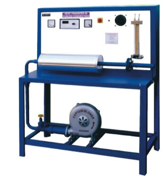
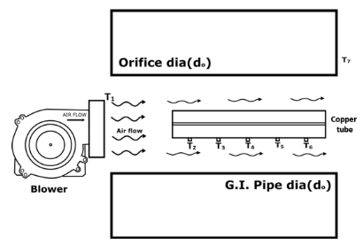

## INTRODUCTION 

#### User Objectives and Goals:
 
1. To determine Mass Density of air
 
2. To determine Heat transfer rate
 
3. To determine heat transfer coefficient
 
4. To determine Vair in the tube
 
5. To determine Vair at orifice

#### Theory
A hot plate of metal will cool faster from a fan than when exposed to
atmosphere. The heat is convected away and the process is called as convective heat
transfer. The velocity at which air blows over the hot plate obviously influences the heat
transfer rate. Fig 1 shows the experimental setup that demonstrates Heat transfered by Forced Convection

  
Fig 1. Experimental Setup of Heat transfered by Forced Convection 
  
Fig 2. Schematic representation of forced convective heat transfer 

Fig 2 shows the schematic representation of forced convective heat transfer.  
The Newton‟s law of cooling in convective heat transfer is given by

Q=h A ∆T 
Where, Q=heat transfer rate, watt 
 A=surface area of heat flow, m2 
 ∆T=overall temperature difference between the wall and fluid in ⁰C
 h= convective heat transfer coefficient (W/m2
⁰C).

The convective heat transfer coefficient depends upon the viscosity of the fluid in addition to
its dependence on the thermal properties of the fluid (thermal conductivity, specific heat,
density, etc). If a heated plate is exposed to ambient room air without all external source of
motion, movement of air would be experienced as a result of the density gradient heat near
plate. We call this natural or free convection. If the convection is experienced the case of the
fan blowing air over a plate, we call this forced convection
